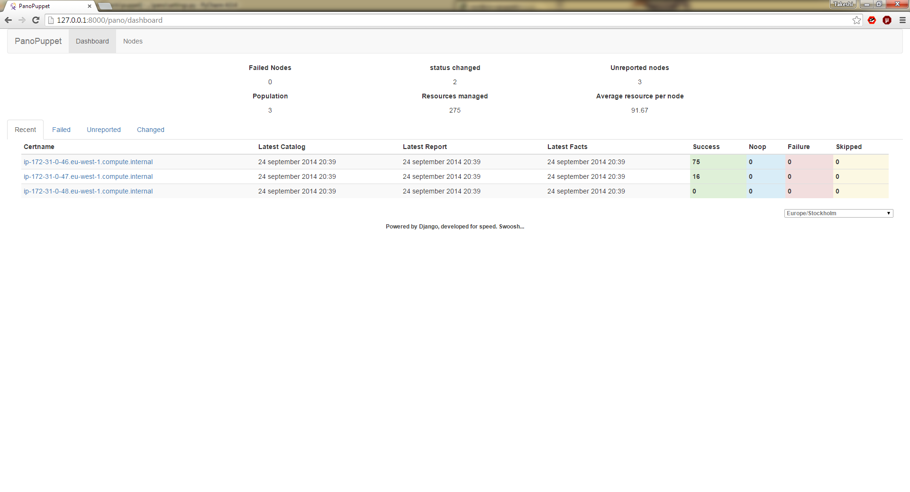
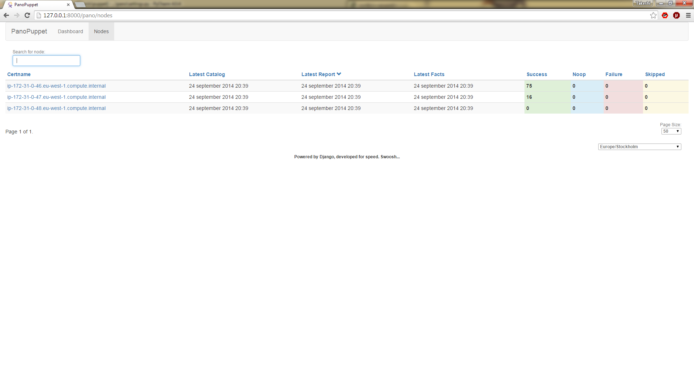
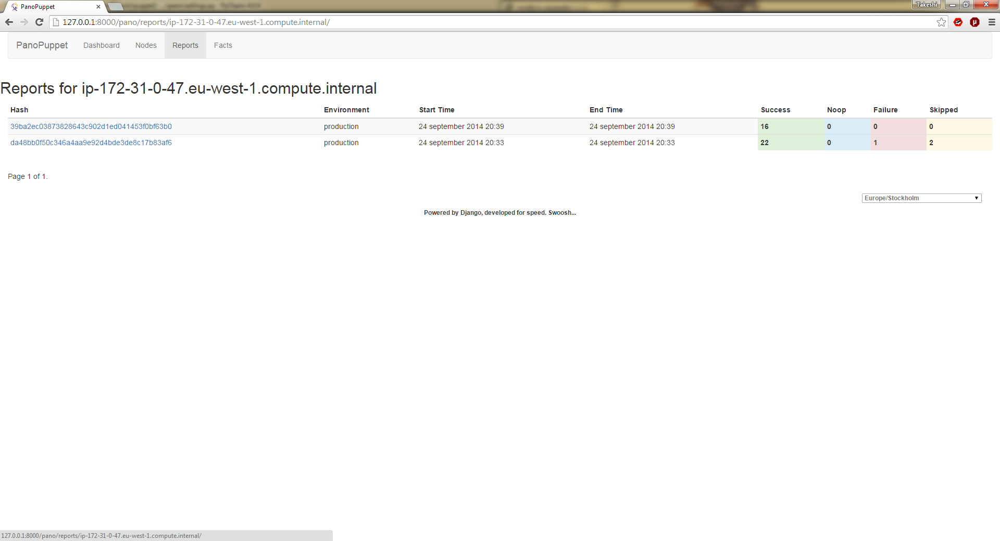
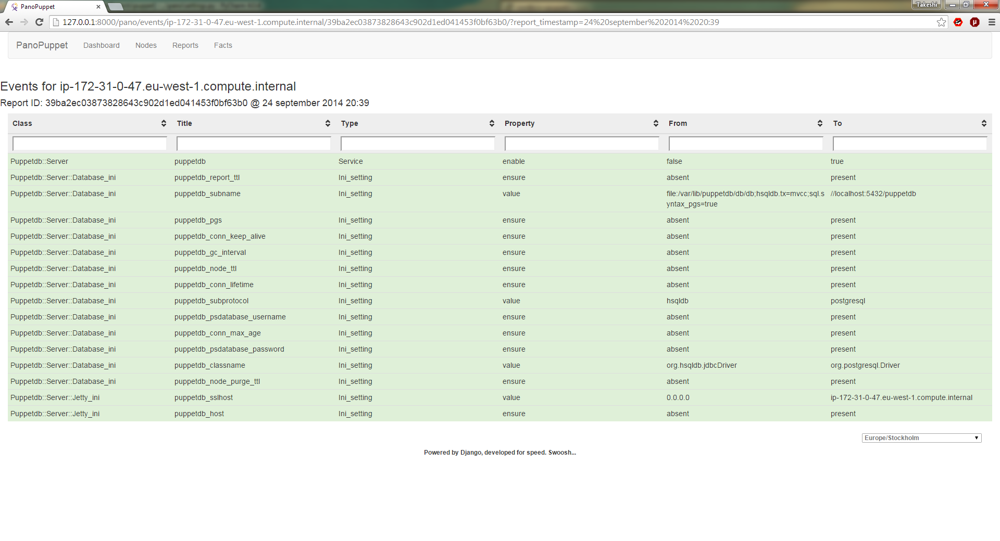
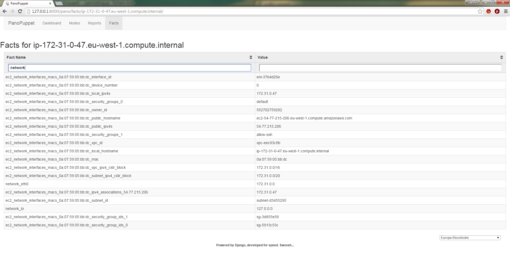

# PanoPuppet

## Features
* Fast and easy to use
* Uses PuppetDB API to retrieve information
* Filebucket and Fileserver support
* Diff support between old and new file
* Fully featured Dashboard for use with PuppetDB
* Analytics Page providing insight into your puppet environment
* LDAP Authentication

## Future plans
* Docker image to quickly install a panopuppet dashboard
* Search nodes by facts and subqueries

### Introduction

PanoPuppet, Panorama Puppet or PP is a web frontend that interfaces with PuppetDB
and gives you a panorama view over your puppet environment(s). Its coded using Python3
using the Django Framework for the web interface and requests library to interface with
puppetDB. It also uses Bootstrap for the CSS and Jquery for some tablesorting.

The interface was written originally as an idea from work, we have tried to
use different types of web interfaces that show the status of the puppet
environment. Most of them were too slow, too bloated to give us the information
we wanted quickly. Why should PuppetDB which has an amazing response time
suffer from a slow frontend. When you reach a point where the environment could
have over 20k puppetized nodes you need something fast.

This was written for a multi-tenant site across several datacenters.

### About the code

I am not a developer really so most of my code could look like it came out of a
rats den. I have followed the PEP8 standards for coding. The comments might be sparse,
sorry for that.

Code has been relatively fixed and optimized even though i'm sure there is much more I can do.

#### Thanks go to...

* [pypuppetdb](https://github.com/puppet-community/pypuppetdb) - Solved some issues which I got stuck at

### Screenshots

### Requirements

Requires python3
install requirements listed in requirements.txt
Recommended to use virtualenv (+ virtualenvwrapper)

#### Problems with python-ldap python 3 fork.
I had some issues installing python-ldap using the python3 fork on a RHEL6 server
Here are some of the issues I had...
 * missing dependencies - yum install python-devel openldap-devel cyrus-sasl-devel
 * GCC not compiling... Follow instructions here... http://bugs.python.org/issue21121

### Installation
I have yet to write proper instructions for installing this mod_wsgi or mod_uwsgi.
This is something that will come...

The master branch has a release which includes:
* ldap authentication
* caching

Upcoming branches:
* no_auth
** There will be no ldap authentication support included.

#### Getting Started
manage.py migrate

#### Development Server - Django runserver...

#### Apache

apache + mod_wsgi is recommended for django in production.
