# PanoPuppet
PanoPuppet is a PuppetDB dashboard, it uses the information available
in PuppetDB and visualizes it for you with lists and graphs.
You are able to browse through the latest changes in reports, nodes, resources,
classes and types. Many features were features requested by my colleagues.

Its written and designed with an enterprise companies needs as a focus point.
Where there are many XFT's and where there may be a need for extra security to
limit the nodes a certain XFT/group should be allowed access too.

For the feature list click here:  [Features](#features)

# Support
* PanoPuppet Releases >= 1.0.0 - Requires PuppetDB == 3.x (Uses the v4 api endpoint)
* PanoPuppet Releases < 1.0.0 - Requires PuppetDB == 2.x (Uses the experimental v4 api endpoint)

To download a specific release you can find them [Here](https://github.com/propyless/panopuppet/releases)

## Use Case
One large company, several hundred XFT's operating from multiples regions.
Security concious company where you may not always want the information available
in PuppetDB available to everyone. Difficult to lock down a ldap/AD group to a
subset of users in PuppetDB alone..

PanoPuppet gives you the ability to create PuppetDB Queries with a easy to use tool
and use those rules to lock down an active directory group to one or more PuppetDB Queries.

Users that have a rule will then only be able to see nodes that match the rule you created.

PanoPuppet enables you to control and delegate the information in PuppetDB to the users
who need it.

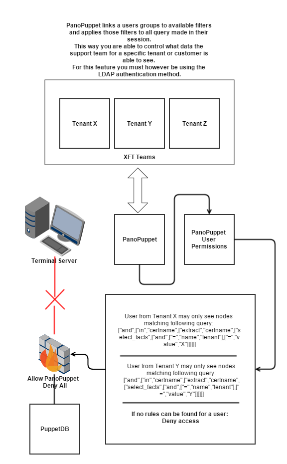

# Some random info and tips...
Since this django app can use LDAP/AD Authentication it can be a bit tricky
to get it working for all Actice Directory designs. The default config works
for the environment I tested it with. I have had other users reporting that
they had to change the ldap code to accept nested groups for example or use
another attr for the login name.
If you need help to get it working you are most welcome to create a support issue
in GitHub.

There is an example configuration for you to look at.
I'd suggest you make a copy and modify the lines you need too.

It is written with Python3, its not Python2 compatible and I
won't ever make it Python2 compatible.
It will be a bit of pain to get working on RHEL7 using SCL so you
will need to make a wrapper that enables SCL python3.


**Table of Contents**

- [PanoPuppet](#panopuppet)
- [Features](#features)
- [Requirements](#requirements)
- [Supported OS](#supported-operating-systems)
- [Notes about puppetv4](#notes-about-puppetv4)
- [Future plans](#future-plans)
- [Introduction](#introduction)
- [Issues](#issues)
  - [QueryBuilder](#querybuilder)
- [Screenshots](#screenshots)
- [LDAP Permissions](#ldap-permissions)
  - [Multiple Groups](#member-of-multiple-groups) 
- [Installation](#installation)
  - [Problems with python-ldap python 3 fork.](#problems-with-python-ldap-python-3-fork)
  - [RHEL/CentOS 6](#rhelcentos-6)
  - [CentOS 7](#centos-7)
- [Upgrading](#upgrading)
- [Configuration Options](#configuration-options)
- [Available branches](#available-branches)
- [Contact Me](#contact-me)
- [Development Server](#development-server)

# Features
* Fast and easy to use
* Uses PuppetDB API to retrieve information
* Filebucket and Fileserver support
* Diff support between old and new file
* Fully featured Dashboard for use with PuppetDB
* Analytics Page providing insight into your puppet environment
* LDAP Authentication
* LDAP Group Permissions - Restrict which servers a group can view
* Events Analyzer (Like Events Inspector from Puppet Enterprise)
* Search nodes by facts and subqueries (Query Builder)
* Export data to CSV with or without selected facts

# Requirements
* PuppetDB requires at least PuppetDB 3.0 or higher (PDB 2.x is no longer supported from release v1.0.0)
* Puppetv3
* Python3
* Install requirements listed in requirements.txt
* Recommended to use virtualenv (+ virtualenvwrapper)

# Supported Operating Systems
* RHEL6,7
* CentOS6,7
* Ubuntu 14.04
* Debian 8 (jessie) - LDAP issues)


# Notes about puppetv4
* Puppetv4 has changed the endpoints for the filebucket and fileserver so you will not be able to view files

It also assumes that you store puppet run reports in PuppetDB
To be able to use Filebucket and Fileserver features and file diffs
you will need to have puppet masters filebucket and fileserver enabled.

# Future plans
* Docker image to quickly install a panopuppet dashboard

# Introduction
PanoPuppet, Panorama Puppet or PP is a web frontend that interfaces with PuppetDB
and gives you a panorama view over your puppet environment(s). Its coded using Python3
using the Django Framework for the web interface and requests library to interface with
puppetDB. It also uses Bootstrap for the CSS and Jquery for some tablesorting.

The interface was written originally as an idea from work, we have tried to
use different types of web interfaces that show the status of the puppet
environment. Most of them were too slow, too bloated to give us the information
we wanted quickly. Why should PuppetDB which has an amazing response time
suffer from a slow frontend. When you reach a point where the environment could
have over 20k puppetized nodes you need something fast.

This was written for a multi-tenant site across several datacenters.

# Issues
##QueryBuilder
* I have seen some issues with the querybuilder and the usage of comparison operators. If you have stringify_facts enabled
you may not be able to use the less/less or equal/greater/greater or equal operators since its not possible to
compare string values "123" with "124". You will only be able to use the equal operator for these values.
* Some new changes implemented for the querybuilder has changed how it works.
To use the Querybuilder you must now be aware that resource queries in the same GROUP are all applied to the same group.
if you want to do two different resource queries you must add a new group and put in there.
It provides more flexibility to the querybuilder since you are able to specify which equality operator you want for
each "filter".

See the below examples:

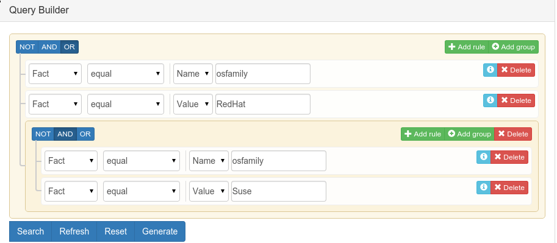

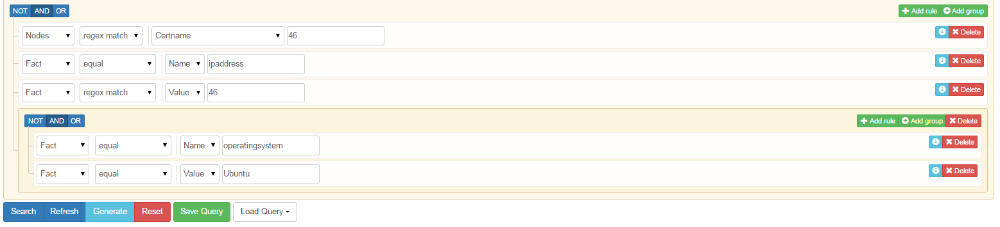


# Screenshots
## Login Page
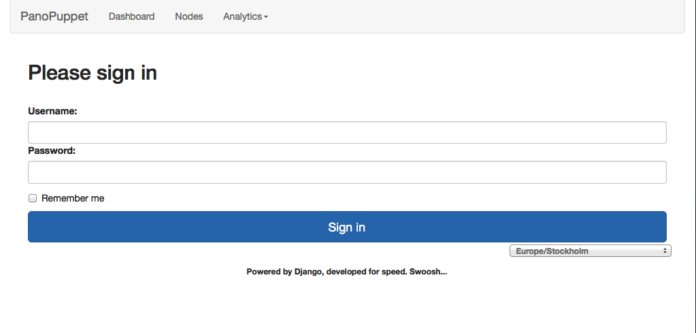

## Dashboard - Recent Tab is the default view
Here you get a quick view over your puppet environment, it shows a summary over
the failed, changed, pending and unreported nodes.
There also is another interesting value you get, the "Missmatching Timestamps"
Since there is currently no implemented way in puppetdb to report nodes with
failed catalog compilations or runs this compares the three different timestamps.
Usually the facts are calculated first and if the latest catalog timestamp is not
within a few minutes of the latest facts timestamp its quite accurate to assume
that the compilation has failed.
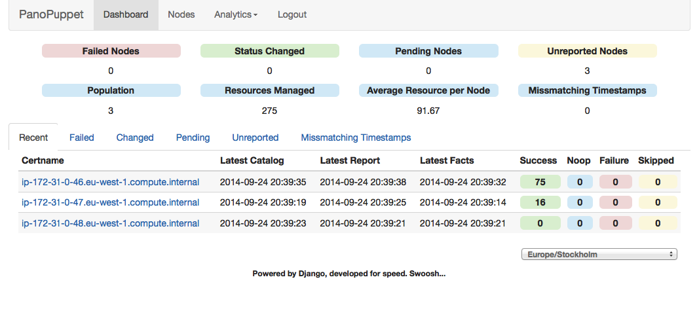

## Radiator View
Just like the Puppetdashboard radiator view, colours match those of bootstrap and
status colours used in PanoPuppet.
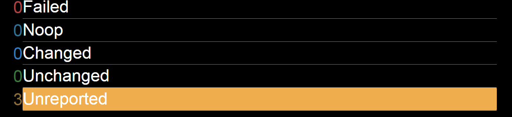

## Nodes View
Here you see all the nodes in paginated iew. You can sort the data by any column.
You also get a quick link to the latest report if there are any events available.
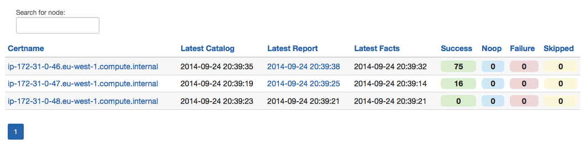

## Nodes Search
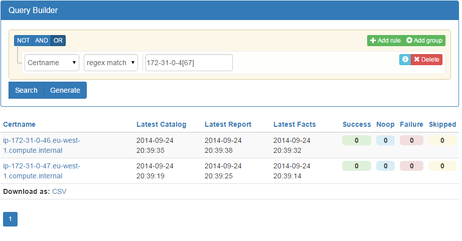
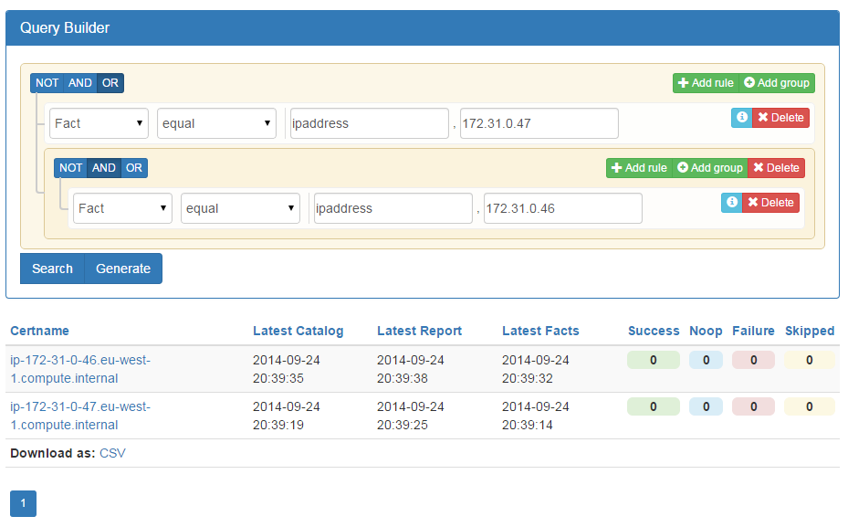

## Loading Queries
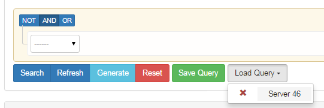

## Nodes Reports
Lists each report available for this node, also urlifys the hash id for the
report there are any events linked to it.
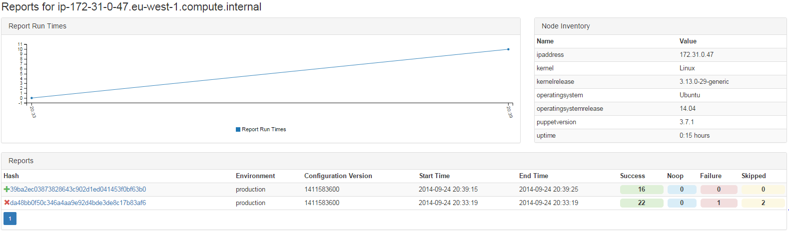

## Nodes Download CSV with specified Facts
With PanoPuppet you can now download a CSV file with the nodess retrieved and you are also able
to download them with certain facts appended to the list for each node
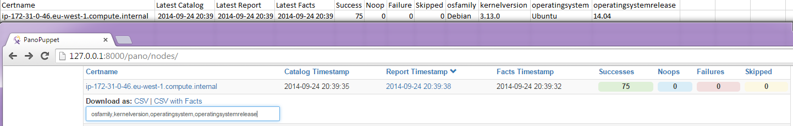

## Nodes Report Events
You can see detailed information for each report event.
If you have the feature activated you can even get files from the Filebucket,
PuppetDB resource and Fileserver. If both files are available you will be
able to get a diff between the files.
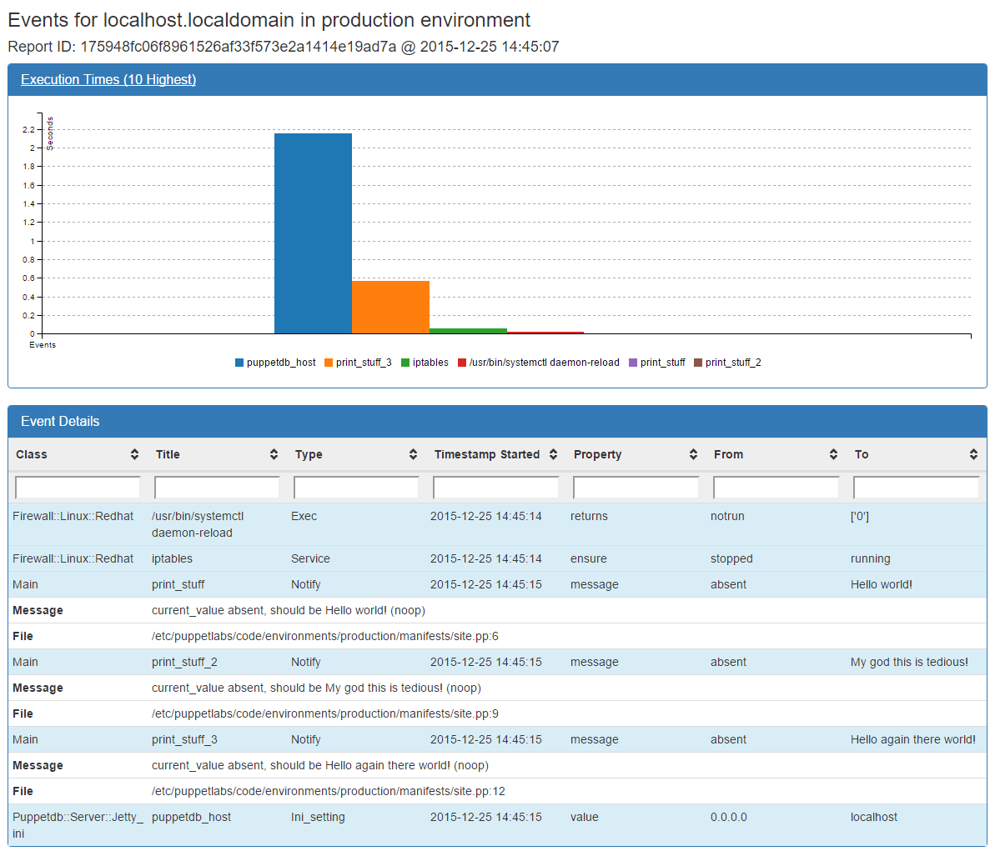

## Nodes Report Agent Log
View the puppet agents console log.
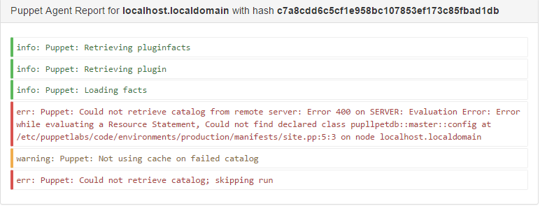

## Node Report Events Execution Times
This graph shows the 10 highest execution times for the puppet run.
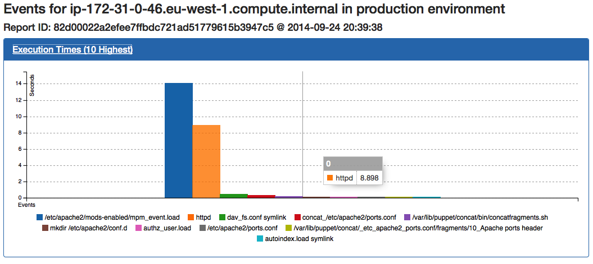

## Latest Run Graphs
Information and events for the latest puppet runs are analyzed and graphs are
drawn to show information about the (up to 100 last runs if available) showing
the puppet run times and a baseline value as the average run time.
It also shows a breakdown over the percentage of classes changed for
the latest puppet runs and percentages over failed, successs and pending
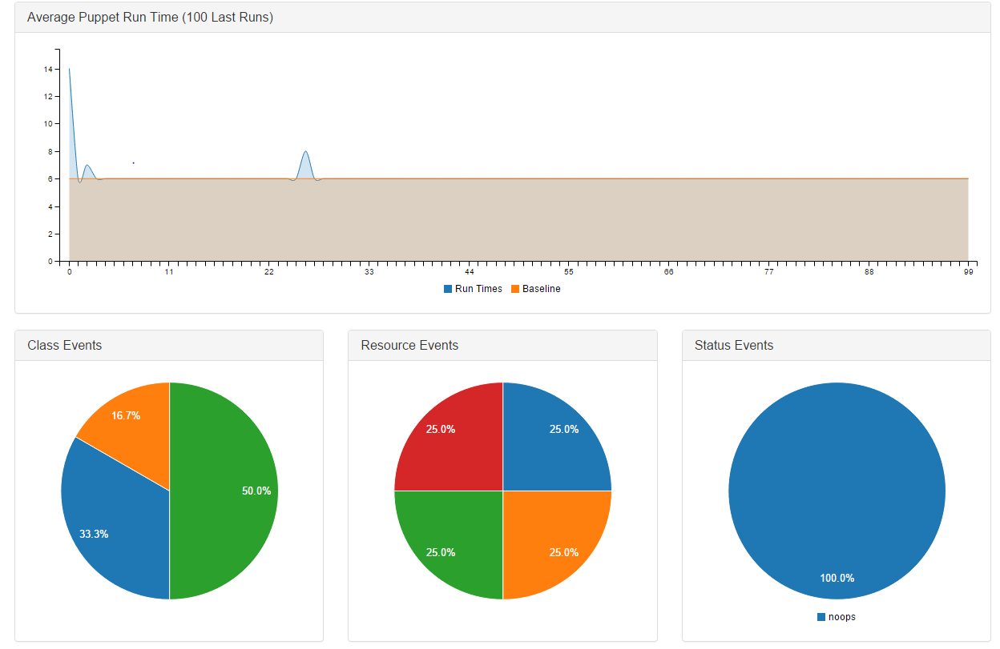

## Events Analytics
The events analyzer lets you quickly see which class, resource, type and node
is failing in your environment. If you have 1000 nodes failing, you can quickly
identify and see if the class "ntp" is failing for all 1000 nodes.
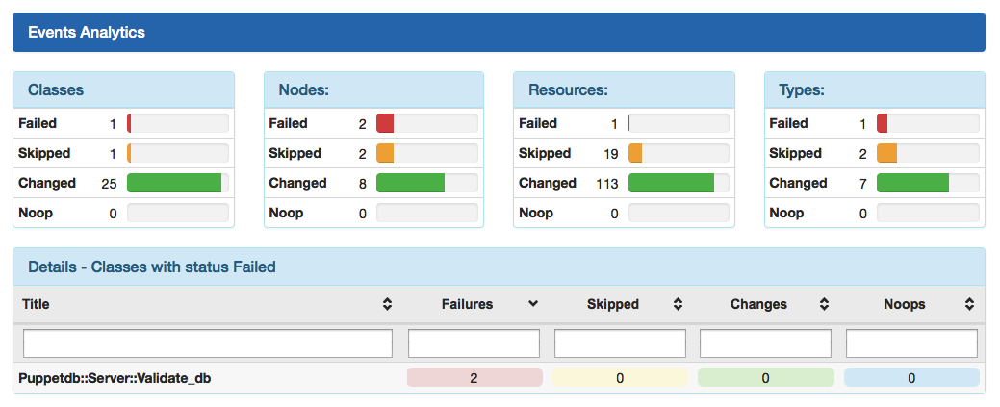
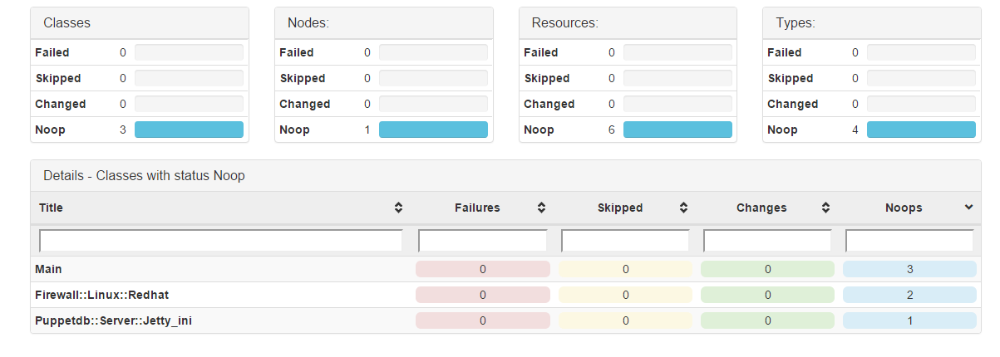
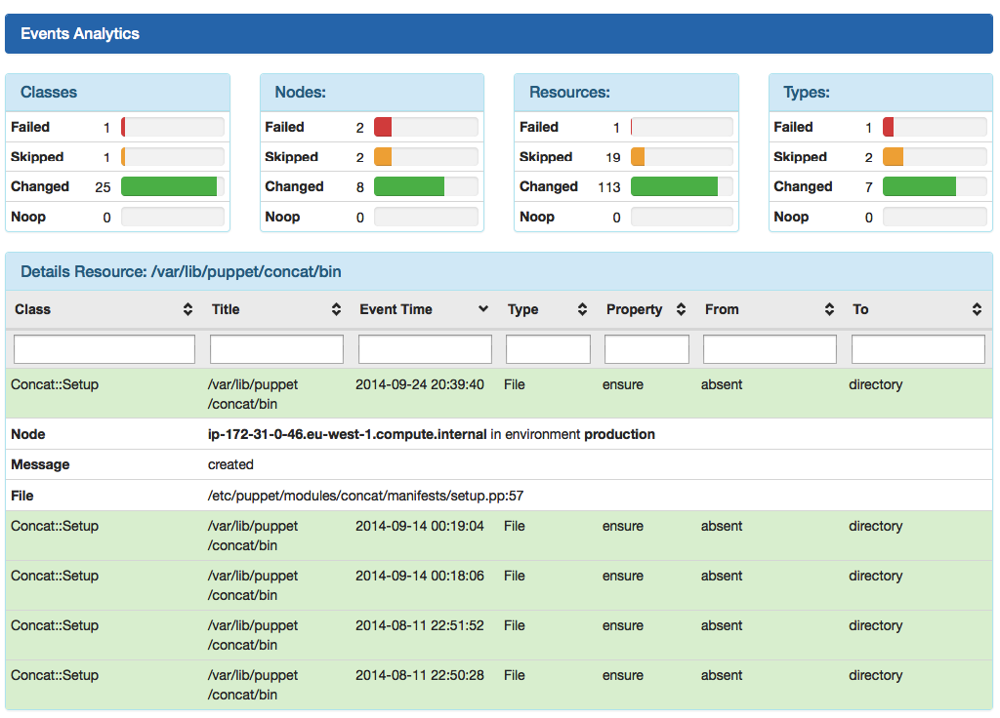

# LDAP Permissions
If you have enabled Permissions on users via the config file `ENABLE_PERMISSIONS: true`
By default no normal user (user that is not superuser or staff) will be able to see any servers
found in PuppetDB.
You must then go to the django admin page `http://<panopuppet-URL>/puppetadmin`, log in as a staff or superuser and add the users
group into the `Ldap group permissionss` table.
The whole CN for the group must be specified.
`cn=puppetusers,ou=groups,dc=example,dc=com`
You must also specify a PuppetDB query which will be appended to all queries made.
The query must use subqueries as it must be able to support all endpoints.
It is highly recommened to use the puppetdb query and generate the query you want to apply.

When the user logs in he or she will only be able to see the results of the puppetdb query you specified for that group.

## Superuser and staff groups
It is possible to make sure that all users in a specific group are allowed to log in to the admin page and see all nodes
by using the two below config options:
LDAP_SUPERUSER_GRP: 'cn=superuser,ou=groups,dc=example,dc=com'
LDAP_STAFF_GRP:
  - 'cn=staff,ou=groups,dc=example,dc=com'
  - 'cn=admin,ou=groups,dc=example,dc=com'
  
You can specify them as a normal string or by specifying them as a list.


## Member of Multiple Groups
If a user is a member of multiple groups which have restrictions set for each one
each rule found will be added in an puppetDB  OR operator, like so. `["and", ["or", [rule1],[rule2]]]`

# Installation

## For other OS other than RHEL and CentOS
While the general directions below work for any OS the package names are most likely different.

A user yotaka has provided me with the packages needed for ubuntu trusty.
```
apt-get install git gcc make apache2 python3 python3-dev libldap2-dev cyrus-sasl2-dbg libsasl2-dev 
python-virtualenv virtualenvwrapper libapache2-mod-wsgi-py3
```
Yotaka also experienced some issues looking like this...
```
[Tue Jun 23 17:34:17.205468 2015] [:error] [pid 12269:tid 139819172513664] Exception ignored in: <module 'threading' from '/usr/lib/python3.4/threading.py'>
[Tue Jun 23 17:34:17.205496 2015] [:error] [pid 12269:tid 139819172513664] Traceback (most recent call last):
[Tue Jun 23 17:34:17.205509 2015] [:error] [pid 12269:tid 139819172513664]   File "/usr/lib/python3.4/threading.py", line 1288, in _shutdown
[Tue Jun 23 17:34:17.205985 2015] [:error] [pid 12269:tid 139819172513664]     assert tlock is not None
[Tue Jun 23 17:34:17.206000 2015] [:error] [pid 12269:tid 139819172513664] AssertionError:
```
If you happen to come across the same problem here is the solution:
http://askubuntu.com/questions/569550/assertionerror-using-apache2-and-libapache2-mod-wsgi-py3-on-ubuntu-14-04-python

## RHEL/CentOS 6
```
This installation "guide" assumes that panopuppet has been extracted to /srv/repo
mkdir -p /srv/repo
cd /srv/repo
git clone https://github.com/propyless/panopuppet.git panopuppet
```

1) Add the IUS and EPEL repository
```
$ sudo yum install epel-release
$ sudo yum install http://dl.iuscommunity.org/pub/ius/stable/CentOS/6/x86_64/ius-release-1.0-11.ius.centos6.noarch.rpm
```

2) Now we can install python 3.x and the ldap dependencies for the python-ldap module
`$ sudo yum install python33 python33-devel openldap-devel cyrus-sasl-devel gcc make`
```
Side note: You should install virtualenv if you do not already use it because its fantastic.
$ sudo yum install python-virtualenv python-virtualenvwrapper
```

3) Install httpd and mod_wsgi for python33
`$ sudo yum install httpd python33-mod_wsgi`

4) We will now if configure virtualenv abit.
```
I usually add the lines below to my .bashrc file and set some environment variables used for virtualenv.
export WORKON_HOME=/srv/.virtualenvs
export PROJECT_HOME=/srv/repo
source /usr/bin/virtualenvwrapper.sh
```
After adding the above lines we need to create the /srv/.virtualenvs directory.
`$ mkdir /srv/.virtualenvs`

5) Create a virtualenv instance for panopuppet. (Make sure that you sourced the bashrc file after modifying it)
`$ which python3`
This will give us the path to python3 which we installed at step 2.
`$ mkvirtualenv -p /usr/bin/python3 panopuppet`
You now have a python virtualenv in /srv/.virtualenvs/panopuppet, if you run the below command you will see that python3 is chosen from the .virtualenv directory.
`$ which python3`
If you want to use the system python3 binary again you can run the command
`$ deactivate`

6) If you ran the deactivate command, run the below command to activate the virtualenv again.
`workon panopuppet`

7)We will install the python modules needed for panopuppet to function.
```
$ cd /srv/repo/panopuppet
$ pip install -r requirements.txt
```

If you hit any troubles with the python-ldap module you may need to run this command before running the pip install command again.
This work around was taken from: http://bugs.python.org/issue21121
`export CFLAGS=$(python3.3 -c 'import sysconfig; print(sysconfig.get_config_var("CFLAGS").replace("-Werror=declaration-after-statement",""))')`

8) This directory will be needed to serve the static files.
mkdir /srv/staticfiles

9) Apache httpd config
```
WSGISocketPrefix /var/run/wsgi
<VirtualHost *:80>
    ServerName pp.your.domain.com
    WSGIDaemonProcess panopuppet user=apache group=apache threads=5 python-path=/srv/repo/panopuppet:/srv/.virtualenvs/panopuppet/lib/python3.3/site-packages
    WSGIScriptAlias / /srv/repo/panopuppet/puppet/wsgi.py
    ErrorLog /var/log/httpd/panopuppet.error.log
    CustomLog /var/log/httpd/panopuppet.access.log combined

    Alias /static /srv/staticfiles/
    <Directory /srv/repo/panopuppet>
        Satisfy Any
        Allow from all
    </Directory>

    <Directory /srv/repo/panopuppet/>
        WSGIProcessGroup panopuppet
    </Directory>
</VirtualHost>
```

10) Configure PanoPuppet
`$ cp /srv/repo/panopuppet/config.yaml.example /srv/repo/panopuppet/config.yaml`
Use your favourite text editor to modify the file with the correct values for your envionrment.
Please note that the example configuration file contains an example for puppetdb connection with and without SSL.

Depending on your puppet infrastructure you may or may not need to specify public, private and cacert to authenticate
with puppetdb, puppetmaster filebucket and fileserver.


11) Populate the /srv/staticfiles with the staticfiles
`$ cd /srv/repo/panopuppet`
`$ python manage.py collectstatic` Say yes to the question it might ask about overwriting files in the /srv/collectstatic folder.

12) chown the /srv/repo/panopuppet directory recursively to the http user you want running panopuppet.
This is to make sure that the panopuppet application can access the local database containing users etc.
Support for other databases will be added at a later time.
Make sure to replace 'apache' with the appropriate user and group.
` chown -R apache:apache /srv/repo/panopuppet`

13) Populate the django database so that users logging in with LDAP or local users are populated into django.
`$ python manage.py makemigrations`
`$ python manage.py migrate`

14) OPTIONAL STEP IF YOU DON'T WANT TO USE LDAP AND YOU ARE JUST TESTING.
Create a local superuser to log in as
`$ python manage.py createsuperuser`
You are able to create some other users in the admin page located at http://panopuppet.your-domain.com/admin

15) Restart Httpd service and it should work.
`/etc/init.d/httpd restart`

## CentOS 7
```
This installation "guide" assumes that panopuppet has been extracted to /srv/repo
$ sudo yum install git
$ sudo mkdir -p /srv/repo
$ sudo chown -R <user> /srv
$ cd /srv/repo
$ git clone https://github.com/propyless/panopuppet.git panopuppet  
```

1) Install the Software Collections repositories for rh-pyhton34 and httpd24.
```
$ sudo yum install scl-utils
$ sudo yum install https://www.softwarecollections.org/en/scls/rhscl/rh-python34/epel-7-x86_64/download/rhscl-rh-python34-epel-7-x86_64.noarch.rpm
$ sudo yum install https://www.softwarecollections.org/en/scls/rhscl/httpd24/epel-7-x86_64/download/rhscl-httpd24-epel-7-x86_64.noarch.rpm
```

2) Install rh-python34 and the dependencies for the python-ldap module.
```
$ sudo yum install rh-python34 libyaml-devel openldap-devel cyrus-sasl-devel gcc make
```

3) Install httpd24.
```
$ sudo yum install httpd24 httpd24-httpd-devel
```
Enable rh-python34 in httpd24;
```
$ sudo vim /opt/rh/httpd24/service-environment
```
Add rh-python34 to HTTPD24_HTTPD_SCLS_ENABLED;
```
HTTPD24_HTTPD_SCLS_ENABLED="httpd24 rh-python34"
```
Enable/start httpd24-httpd service;
```
$ sudo systemctl enable httpd24-httpd
$ sudo systemctl start httpd24-httpd
$ sudo systemctl status httpd24-httpd
```
Configure firewall for httpd24;
```
$ sudo firewall-cmd --permanent --add-service=http
$ sudo firewall-cmd --add-service=http
```

4) Compile mod_wsgi for rh-python34.  
rh-python34-mod_wsgi contains a 'bug' which will segfault panopuppet, that's why we compile the latest version.
```
$ cd
$ scl enable rh-python34 bash
$ scl enable httpd24 bash
$ sudo yum install wget
$ wget https://pypi.python.org/packages/source/m/mod_wsgi/mod_wsgi-4.4.21.tar.gz
$ tar -xzvf mod_wsgi-4.4.21.tar.gz
$ cd mod_wsgi-4.4.21
```
Determine location of rh-pyhton34 version;
```
$ which python
```
Use this location in the configure of mod_wsgi;
```
$ ./configure --with-python=/opt/rh/rh-python34/root/usr/bin/python
$ make 
$ sudo make install
```
Configure mod_wsgi module for httpd24;
```
$ sudo vim /opt/rh/httpd24/root/etc/httpd/conf.modules.d/10-mod_wsgi-4421.conf
```
Contents;
```
LoadModule wsgi_module modules/mod_wsgi.so
```

5) Create a virtualenv instance for panopuppet.
```
$ sudo mkdir /srv/.virtualenvs
$ sudo chown <user> /srv/.virtualenvs
$ cd /srv/.virtualenvs
$ virtualenv panopuppet
$ cd panopuppet/
$ source bin/activate
```

6) Install the python modules needed for panopuppet to function.
```
$ cd /srv/repo/panopuppet
$ pip install -r requirements.txt
```

7) Create Panopuppet config for httpd24.
```
sudo vim /opt/rh/httpd24/root/etc/httpd/conf.d/panopuppet.conf
```
Contents;
```
WSGISocketPrefix /var/run/wsgi
<VirtualHost *:80>
    ServerName pp.your.domain.com
    WSGIDaemonProcess panopuppet user=apache group=apache threads=5 python-path=/srv/repo/panopuppet:/srv/.virtualenvs/panopuppet/lib/python3.4/site-packages
    WSGIScriptAlias / /srv/repo/panopuppet/puppet/wsgi.py
    ErrorLog /var/log/httpd24/panopuppet.error.log
    CustomLog /var/log/httpd24/panopuppet.access.log combined

    Alias /static /srv/staticfiles/
    <Directory /srv/staticfiles>
	    Require all granted
    </Directory>
    <Directory /srv/repo/panopuppet>
        Require all granted
    </Directory>

    <Directory /srv/repo/panopuppet/>
        WSGIProcessGroup panopuppet
    </Directory>
</VirtualHost>
```

8) Configure PanoPuppet config.yaml file.
```
$ cp /srv/repo/panopuppet/config.yaml.example /srv/repo/panopuppet/config.yaml
```
Use your favourite text editor to modify the file with the correct values for your envionrment.
Please note that the example configuration file contains an example for puppetdb connection with and without SSL.

Depending on your puppet infrastructure you may or may not need to specify public, private and cacert to authenticate
with puppetdb, puppetmaster filebucket and fileserver.

9) Populate the /srv/staticfiles directory with the staticfiles.
```
$ sudo mkdir /srv/staticfiles
$ sudo chown <user> /srv/staticfiles 
$ cd /srv/repo/panopuppet
$ python manage.py collectstatic
```
Say 'yes' to the question it might ask about overwriting files in the /srv/collectstatic folder.

10) Populate the django database so that users logging in with LDAP or local users are populated into django.
```
$ python manage.py makemigrations
$ python manage.py migrate
```

11) OPTIONAL STEP IF YOU DON'T WANT TO USE LDAP AND YOU ARE JUST TESTING.  
Create a local superuser to log in as
```
$ python manage.py createsuperuser
```
You are able to create some other users in the admin page located at http://pp.your.domain.com/puppetadmin

12) chown the /srv/repo/panopuppet directory recursively to the http user you want running panopuppet.
This is to make sure that the panopuppet application can access the local database containing users etc.
Support for other databases will be added at a later time.
Make sure to replace 'apache' with the appropriate user and group.
```
$ sudo chown -R apache:apache /srv/repo/panopuppet
```

13) Configure SELinux for panopuppet
```
sudo setsebool -P httpd_can_network_connect on
sudo semanage fcontext -a -t httpd_sys_content_t "/srv/repo/panopuppet/pano(/.*)?"
sudo semanage fcontext -a -t httpd_sys_content_t "/srv/repo/panopuppet/puppet(/.*)?"
sudo semanage fcontext -a -t httpd_sys_content_t "/srv/repo/panopuppet/config.yaml"
sudo semanage fcontext -a -t httpd_sys_rw_content_t "/srv/repo/panopuppet"
sudo semanage fcontext -a -t httpd_sys_rw_content_t "/srv/repo/panopuppet/db.sqlite3"
sudo semanage fcontext -a -t httpd_sys_content_t "/srv/staticfiles(/.*)?"
sudo semanage fcontext -a -t bin_t "/srv/.virtualenvs/panopuppet/bin(/.*)?"
sudo semanage fcontext -a -t lib_t "/srv/.virtualenvs/panopuppet/lib(/.*)?"
sudo restorecon -vFR /srv/
``` 

14) Restart httpd24-httpd service and it should work.
```
$ sudo systemctl restart httpd24-httpd
```

# Upgrading
Upgrading PanoPuppet should be no harder than doing a git pull origin/master in the /srv/repo/panopuppet directory.
But its recommended to run the `python manage.py collectstatic` command again in case new css/javascripts have been added so that they
are served to your clients. Also make sure to read the config.yaml.example file and see if any new variables have been
implemented!

Upgrading PanoPuppet has a few new steps now as user profiles and permissions has been implemented.
Now you should always run the following commands when updating panopuppet.
`python manage.py collectstatic`
`python manage.py migrate`
`python manage.py makemigration`
If it doesnt apply any changes, that just means that no changes were done to the database for those latest commits.

# Configuration Options
NODES_DEFAULT_FACTS - Is a list of facts to be shown on the node report page. 
                      Default value is: ['operatingsystem', 'operatingsystemrelease', 'puppetversion', 'kernel', 'kernelrelease', 'ipaddress', 'uptime']

# Available branches
The master branch has a release which includes:
* ldap authentication
* caching

Upcoming branches:
* no_auth
  * There will be no ldap authentication support included.

# Contact Me
If you have any questions you are welcome to contact me @ chat.freenode.net - My nickname is Propyless
and if I do not respond you may leave me an email and I will reply to your question there.

You can also find me in #panopuppet @ chat.freenode.net

# Development Server 
Django runserver...
